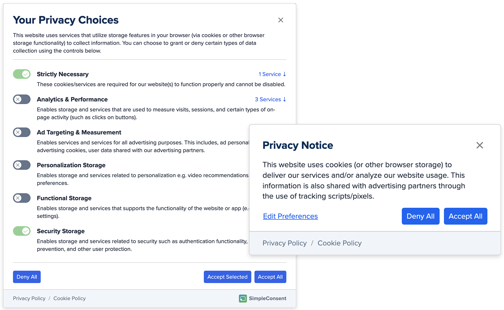

# SimpleConsent.js



---

> [!WARNING] 
> **This project is in active development.**
> 
> A proper release will be tagged when ready. There are likely bugs and missing features at this point in time.

---

> [!CAUTION]
> **Legal Disclaimer! The maintainers of this library are not data-privacy lawyers, and this library's defaults and/or example configurations may not meet your specific legal requirements and are NOT a substitute for proper legal counsel.**
> 
> Installing this library on your website WILL NOT "magically" make it compliant with regional data collection laws - it must be configured properly with Google Tag Manager to work correctly. This is true for any consent management tools, they cannot guarantee compliance (also - if they say otherwise - they're lying to you).
> 
> **It cannot be understated to always consult with a data privacy professional to ensure your consent banner configuration is compliant with regional data collection laws.**

---

### Foreword

This project is/was inspired by [Klaro](https://github.com/klaro-org/klaro-js). Klaro is another great open-source consent project, and does a LOT more than this library - especially around "autoblocking" behavior. However, Klaro takes a "services first" approach to its configuration instead of "consent types". This makes Klaro a bit harder to use with GTM and more specifically its consent signal APIs that are "type/behavior" focused. So TL;DR - if this library doesn't fit your needs, check out Klaro - it very well could.

### Why should I use this?

SimpleConsent is a tool to help technical marketers and/or developers comply with the data-collection laws using a lightweight alternative to expensive 3rd party services like OneTrust or CookieBot. 

#### ⚡️ Lightweight (< 10KB gzipped)
[](https://github.com/derekcavaliero/simpleconsent/blob/main/dist/SimpleConsent.min.js)
[](https://github.com/derekcavaliero/simpleconsent/blob/main/dist/SimpleConsent.min.css)

Compare this to bloated CMPs like OneTrust or CookieBot which can be 100KB+ in size AFTER GZip compression.

#### ⚙️ Configuration First
If you... 
- Can write basic JSON structures, you can configure it 
- Can write some basic CSS, you can style it
- Use a front-end component library, you can customize the underlying UI templates
- Have access to Cloudflare Workers, or Server-Side GTM, (or similar tech) you can create multi-config routing based on the users geolocation

#### 🏷️ Google Tag Manager (GTM) Focused
Designed to work with GTM's consent signal APIs and provide better ergonomics for GTM users.

#### ✅ This library might be a fit if you...

1. Use Google Tag Manager (GTM) as your TMS
2. Aren't afraid to write some basic JS/JSON and CSS to configure and customize it.
3. Want a 1st party solution that doesn't rely on 3rd party services. 
4. Are fed up with bloated CMPs like OneTrust or CookieBot hurting your site's performance.

#### ❌ This library isn't a fit if you...

1. Don't use Google Tag Manager (GTM) as your TMS
2. Require "autoblocking" behavior
3. Require IAB TCF v2.X compaitibility
4. Require AMP compatibility
5. Require support for dead browsers like Internet Explorer
6. Need "baked in" (cookie pun intended) geolocation routing or a built-in cookie scanner.

### Contributing

If you would like to contribute to this project, please see the [CONTRIBUTING.md](CONTRIBUTING.md) file for more information.

---

### Installation

In order to use SimpleConsent, 3 things are required. If you have used Klaro before, this process is identical.

1. **A configuration file/object** that is loaded by your site. You may also have your configuration bundled into other JS files if you prefer - but, for the sake of maintainability, it is recommended to keep it separate.
2. **Library CSS** `SimpleConsent.min.css`
3. **Library JS** `SimpleConsent.min.js` with a `data-consent-config` attribute that points to the global configuration object that will be loaded. 

#### Via CDN (jsDelivr)
You can do this by adding the following code to your website's `<head>`.

```html
<link href="https://cdn.jsdelivr.net/gh/WebMechanix/SimpleConsent@release/dist/SimpleConsent.min.css" rel="stylesheet">
<script defer src="/path/to/consentConfig.js"></script>
<script defer src="https://cdn.jsdelivr.net/gh/WebMechanix/SimpleConsent@release/dist/SimpleConsent.min.js" data-consent-config="consentConfig"></script>
```

> [!CAUTION]
> If you're loading the library via jsDelivr (as shown above), **we don't suggest using `@latest` in a production environment** as it may introduce breaking changes for major version changes in the future. Pick a release version instead.

### Configuration

Inside the `consentConfig.js` (or whatever you chose for a filename) file, you will need to define a global object called `consentConfig` (or whatever you chose for global object) that will be used to configure the consent manager behavior. This configuration object is merged with the default configuration object provided by the library allowing you to override any default settings. 

```javascript
/** 
 * ℹ️ SimpleConsent will clean up the global scope after initialization, 
 * As such, this object will not be available to other scripts on your page.
 */
window.consentConfig = window.consentConfig || {
  "consentModel": "opt-out",
  "content": {
    "banner": {
      "heading": "🍪 Notice",
      "description": "This website uses cookies (or other browser storage) to deliver our services and/or analyze our website usage.",
    }
  }
};
```

The above example will display a banner with the title "🍪 Notice" and use an "opt-out" consent model (meaning the default consent types are all enabled until the user disables them).

You can view the source of the default `#config` object in the SimpleConsent class. Each configration object is annotated with JSDoc comments to help you understand what each property does.

#### Defining Types

Consent types are the individual categories of data collection/storage that your website (and its services) perform/use. These types are what users will allow/deny when interacting with the consent preferences UI. Types are defined using the `types` configration property. Each consent type can have the following properties:

| Property | Type | Description |
| :------------ | :-------- | :--- |
| `name`        | `string`  | The title of the consent type (what is show to the end user). |
| `description` | `string`  | Brief (1-2 sentences) explanation of what services/storage is used for the consent type. |
| `required`    | `boolean` | Changes the consent toggle to `disabled` and `granted` if set to `true`. | 
| `gpc`         | `boolean` | If `true`, the consent type will be automatically disabled if a `navigator.globalPrivacyControl` is detected. |
| `mapTo`       | `array`   | Used to map a particular consent type to other types (useful for Google's Consent Mode). This is an array of strings that represent consent type keys. (e.g. `ad_user_data`, `ad_storage`, `ad_personalization` etc...). |

> [!NOTE]
> The library automatically adds a "necessary" type consent type. You do not need to define one.

**Example:**
```json
{
  "analytics_storage": {
    "name": "Analytics & Performance",
    "description": "Enables storage and services that are used to measure visits, sessions, and certain types of on-page activity (such as clicks on buttons).",
    "gpc": true,
  },
  "advertising": {
    "name": "Advertising Targeting & Measurement",
    "description": "Enables services and services for all advertising purposes. This includes, ad personalization, advertising cookies, user data shared with our advertising partners.",
    "mapTo" : ["ad_storage", "ad_personalization", "ad_user_data"],
    "gpc": true,
  },
  "personalization_storage": {
    "name": "Personalization Storage",
    "description": "Enables storage and services related to personalization e.g. video recommendations, and account preferences.",
  },
  "functionality_storage": {
    "name": "Functional Storage",
    "description": "Enables storage and services that supports the functionality of the website or app (e.g. language settings).",
  },
  "security_storage": {
    "name": "Security Storage",
    "description": "Enables storage and services related to security such as authentication functionality, fraud prevention, and other user protection.",
    "required": true,
  }
}
```

Each consent type is defined with its own "key" (e.g. `analytics_storage`, `advertising`, etc...). These keys are used to reference the consent types in the configuration object. These are also the keys that are used when pushing `dataLayer` events to Google Tag Manager, and also the stored consent object in cookies and/or localStorage.

#### Defining Services

Services are the individual scripts or tags that are loaded on your website that require consent. A service can belong to one or more consent types. Services are defined using the `services` property in the configuration object. This services object is used to generate a cookie policy, and each service will be listed under its respective consent type inside the consent settings modal.

**Example:**
```json
{
  "cloudflare": {
    "name": "Cloudflare",
    "description": "Provides security and performance optimization for websites, protecting them from malicious traffic while improving load times by caching content and optimizing delivery.",
    "domain": "cloudflare.com",
    "storage": {
      "security": {
        "__cf_bm": {
          "purpose": "Contains information related to the calculation of Cloudflare's proprietary bot score and, when Anomaly Detection is enabled on Bot Management, a session identifier.",
          "expires": "30 minutes"
        }
      }
    },
    "types": ["necessary", "security_storage"]
  },
  "google_analytics": {
    "name": "Google Analytics",
    "description": "Tracks and reports website traffic and user behavior, helping to analyze visitor data for improving site performance and user experience.",
    "domain": "analytics.google.com",
    "storage": {
      "analytics_storage": {
        "_ga": {
          "purpose": "Browser (client) indentifer. Used to distinguish a unique browser (anonymous user).",
          "expires": "2 years"
        },
        "_ga_XXXXXXXXXX": {
          "pattern": "/_ga_[A-Z\\d]{6,}/",
          "purpose": "Session indentifer. Used to distinguish current session, session count, and other related session information.",
          "expires": "2 years"
        }
      }
    },
    "types": ["analytics_storage", "advertising"]
  },
  "google_ads": {
    "name": "Google Ads",
    "domain": "ads.google.com",
    "description": "Online advertising platform that allows businesses to create ads that appear on Google's search engine and other properties, targeting users based on their search queries and interests.",
    "storage": {
      "advertising": {
        "_gcl_au": {
          "purpose": "",
          "expires": "90 days"
        },
        "_gcl_aw": {
          "purpose": "Stores click identifier and timestamp of the most recent Google Ads click.",
          "expires": "90 days"
        }
      }
    },
    "types": ["advertising"]
  },
  "hubspot": {
    "name": "HubSpot",
    "description": "Marketing Automation & CRM platform that includes tools for marketing, sales, and customer service, offering features like email marketing, analytics, and lead tracking.",
    "domain": "hubspot.com",
    "storage": {
      "analytics_storage": {
        "__hssc": {
          "purpose": "This cookie keeps track of sessions. This is used to determine if HubSpot should increment the session number and timestamps in the __hstc cookie. It contains the domain, viewCount (increments each pageView in a session), and session start timestamp.",
          "expires": "30 minutes"
        },
        "__hssrc": {
          "purpose": "Whenever HubSpot changes the session cookie, this cookie is also set to determine if the visitor has restarted their browser. If this cookie does not exist when HubSpot manages cookies, it is considered a new session. It contains the value \"1\" when present.",
          "expires": "1 year"
        },
        "__hstc": {
          "purpose": "The main cookie for tracking visitors. Contains the domain, hubspotutk, initial timestamp (first visit), last timestamp (last visit), current timestamp (this visit), and session number (increments for each subsequent session).",
          "expires": "180 days"
        },
        "hubspotutk": {
          "purpose": "Keeps track of a visitor's identity. It is passed to HubSpot on form submission and used when deduplicating contacts. It contains an opaque GUID to represent the current visitor.",
          "expires": "180 days"
        },
        "messagesUtk": {
          "purpose": "Used by to recognize visitors who use HubSpot chatbots and live chat features. ",
          "expires": "180 days"
        }
      }
    },
    "types": ["analytics_storage", "personalization_storage"]
  }
}
```

### Google Tag Manager Integration

> [!TIP]
> Check out the provided [Testbench GTM container export](testbench/assets/GTM-testbench-default.json) to get familar with the trigger/variable configuration.

#### `simple-consent:load` Event

When the consent banner is loaded, a `dataLayer` event is pushed to Google Tag Manager with the following structure:

```javascript
dataLayer.push({
  event: 'simple-consent:load',
  consent: {
    // key:value pairs for each consent type set to "granted" or "denied".
    // If a type is mapped to another type, the mapped type will be set to the same value as the original type (see "mapTo" in the advertising type definition above)
    analytics_storage: 'denied',
    advertising: 'denied',
    ad_storage: 'denied',
    ad_personalization: 'denied',
    ad_user_data: 'denied',
    personalization_storage: 'denied',
    functionality_storage: 'denied',
    security_storage: 'granted',
  },
  consentMeta: {
    consentModel: 'opt-in', // opt-in or opt-out - pulled from the loaded config.
    geo: null,              // a value from your own geolocation lookup if using a multi-config setup null otherwise
    gpc: false,             // true if the user has Global Privacy Control enabled false otherwise
  }
})
```

Directly before the `simple-consent:load` event payload is pushed, a `gtag('consent', 'default', {})` command is pushed with the same `consent` object payload. This ensures that the consent signal is properly set in Google Tag Manager before any tags configured to use the consent signal are fired.

#### `simple-consent:update` Event

```javascript
dataLayer.push({
  event: 'simple-consent:update',
  consent: {
    analytics_storage: 'granted',
    advertising: 'granted',
    ad_storage: 'granted',
    ad_personalization: 'granted',
    ad_user_data: 'granted',
    personalization_storage: 'granted',
    functionality_storage: 'granted',
    security_storage: 'granted',
  },
  consentMeta: { 
    //... 
  }
})
```

Similar to `simple-consent:load`, directly before the `simple-consent:update` event payload is pushed, a `gtag('consent', 'update', { ... })` command is pushed with the same `consent` object payload.

#### Trigger/Variable Setup

The in most cases - you'll likely have a "Consent / grated - [type]" trigger for each consent type that you want to fire tags on. It's suggested to use a custom event trigger that matches both the load and update events via regex `simple-consent:(load|update)` to handle both opt-in and opt-out consent models.

> [!IMPORTANT]
> - You should avoid using "All Pages", "Initialization", or "Consent Initialization" trigger types for any of your tags that require consent. Failing to do so will result in the tags firing before the consent signals are set. Instead, use the custom events documented above as a trigger(s) for your tags that should fire on page load or related events.
> - GTM's "Require additional consent for tag to fire" tag setting has a known bug with the "fire one per page" setting. For this reason, its best to avoid using the additional consent checks feature on tags that use this setting.
